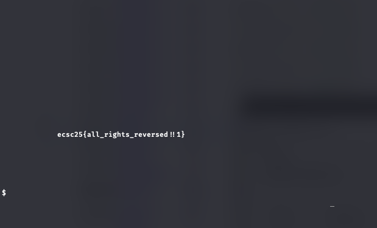

# Sneaky Train

I decompiled the binary with ghidra and analyzed the code, the snake freezes once it gets to the length of 5, then it requires input of specific keystrokes to continue, after that it sends the flag once the snake gets to the length of the flag.

Static analysis of the decompiled code by LLM:
```
cStack_5f5 is 's'
uStack_5f4 is 'r' (this one was not reassigned)
uStack_5f3 is 99, which is ASCII for 'c'
uStack_5f2 is 0x72, which is ASCII for 'r'
uStack_5f1 is 0x65, which is ASCII for 'e'
uStack_5f0 is 0x74, which is ASCII for 't'
uStack_5ef is 'x'
uStack_5ee is 'x'
uStack_5ed is 'x'
uStack_5ec is 'x'
```

I figured that the keystrokes combination is going to be `secretxxxx`.

flag: `ecsc25{all_rights_reversed!!1}`

